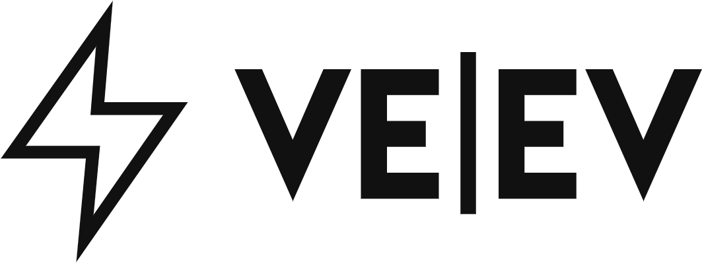

# VE|EV
<!-- ADD LOGO
<div align="center">
  <a href="https://github.com/TomSmail/easy-a-cambridge">
    
  </a>
</div>
-->

<!-- TABLE OF CONTENTS -->
<details>
  <summary>Table of Contents</summary>
  <ol>
    <li><a href="#summary">Summary</a></li>
    <li><a href="#about-the-project">About The Project</a></li>
    <!--<li>
      <a href="#getting-started">Getting Started</a>
      <ul>
        <li><a href="#prerequisites">Prerequisites</a></li>
        <li><a href="#installation">Installation</a></li>
      </ul>
    </li>-->
    <li><a href="#roadmap">Roadmap</a></li>
    <li><a href="#contact">Contact</a></li>
    <li><a href="#acknowledgments">Acknowledgments</a></li>
  </ol>
</details>

## Summary
EV owners are currently paying for energy from non-sustainable sources and don't have the option to charge using sustainable power. To solve this we have devised a way to put energy onto the blockchain, using our proprietary VEEV coin so EV owners can buy directly from Green-Energy producers. They are incentivised to do this using VeChain's 'buy green to earn' framework, where they receive VET as a reward when they purchase green energy.

## About The Project
<!-- ADD HOMESCREEN  -->

<div align="center">
  <a href="https://github.com/TomSmail/easy-a-cambridge">
    
  </a>
</div>


* VE|EV gives electric vehicle owners the power to choose where they source their energy – handled and authenticated through VechainThor blockchain.

* We reward those who charge with sustainable sources VET, offering them discounts on sustainable energy with the aim of encouraging sustainable energy production.

* We hope to diversify our service to extend beyond electric charging; we see our VE|EV token becoming an industry standard for sustainable energy, and empowering individuals with their own solar farms and wind turbines to sell back to the grid. We see ourselves holding firms and consumers accountable for their consumption while rewarding sustainable consumers.

### Built With
* VeChain

<p align="right">(<a href="#readme-top">back to top</a>)</p>

## Getting Started

To run: [1] clone repo [2] cd sample-vanilla-app [3] yarn (if first time) [4] yarn dev
<!--
### Prerequisites

List things you need to use the software and how to install them.
* npm
  ```sh
  npm install npm@latest -g
  ```

### Installation

_Instruct audience on installing and setting up app._
<!--


<p align="right">(<a href="#readme-top">back to top</a>)</p>
-->

## Roadmap 
<div align="center">
  <a href="https://github.com/TomSmail/easy-a-cambridge">
    
  </a>
</div>

<p align="right">(<a href="#readme-top">back to top</a>)</p>

## Contact
VE|EV - [@the_VEEV_team](https://twitter.com/the_VEEV_team) - email@example.com
<p align="right">(<a href="#readme-top">back to top</a>)</p>

## Acknowledgements
<p align="right">(<a href="#readme-top">back to top</a>)</p>


<!-- MARKDOWN LINKS & IMAGES js, vechain sdk,
[homepage-screenshot]: sample-vanilla-app/assets/images/homepage.jpg
-->
